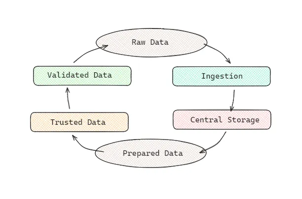

# What Beyonce and Sandwiches taught me about Data Ecosystems

Like most beyhive in tech, I often find myself “right-click inspecting” code on beyonce.com. Instead of looking for a tour page this time, I went to the HTML header to find potential data sources that Bey and the awesome team at Parkwood Entertainment might be using for internal analysis.

The technical feats and cultural impact of the Renaissance World Tour has the world on the edge of its seat waiting for another appearance for our generation’s diva (thank you Blue Ivy for keeping that track on the setlist). I, too, have started imagining the next tour.

The first week of the Data School gave me the opportunity to research the data ecosystem that supports our queen and her team as they deliver iconic merch and generational performances.

Data Ecosystems describe the cyclical processes and technical requirements that support data-driven efforts, like live music tours. Our head coach uses a sandwich analogy to help us understand our place in the data life cycle as analytics consultants. Someone buys the theoretical sandwich, their purchase data is stored and related to other menu items, then an analyst uses a trusted dataset to help market the sandwich to the next customer.

This business-led analytics pipeline kind of flows like this:

Like any good sandwich, you can add or subtract layers to your needs and preferences.

I used this framework to explore a possible pipeline to support Beyonce’s next tour. I uncovered ways that Parkwood’s technical program manager and experiential producers could use Tableau and Alteryx to monitor and optimize the tour planning process, while also leveraging their current cloud and programming expertise.

From inspecting the website, I learned that they use Shopify, which has an API for ingesting data into an AWS or GCP central storage system.
For listening data, Cowboy Carter metrics can be queried directly from services using tools like Spotify Publishing Analytics or communicating with the team at Tidal.
If mama Tina is willing, we may be able to use her Instagram analytics to monitor social media engagement.
Alteryx can be used to set up automated processes:

Union tables from multiple streaming services
Aggregate daily song performance
Clean and structure spatial oriented sales data
Tableau can then be used to present top tracks for band prep, supply tour vendors with merch, and decide where to take the Rodeo Chitlin’ Circuit!

I am having a lot of fun with these new data concepts. I can’t wait to share more here on the Data School Blog.